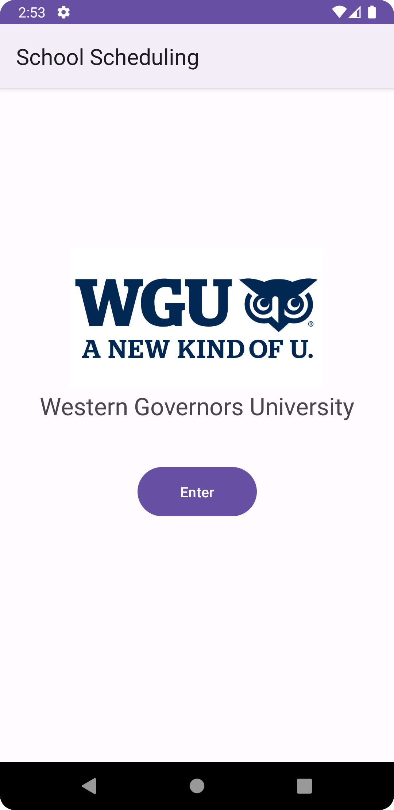
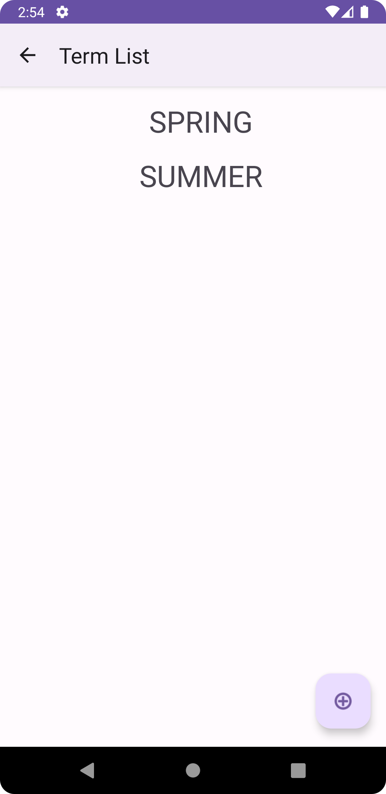
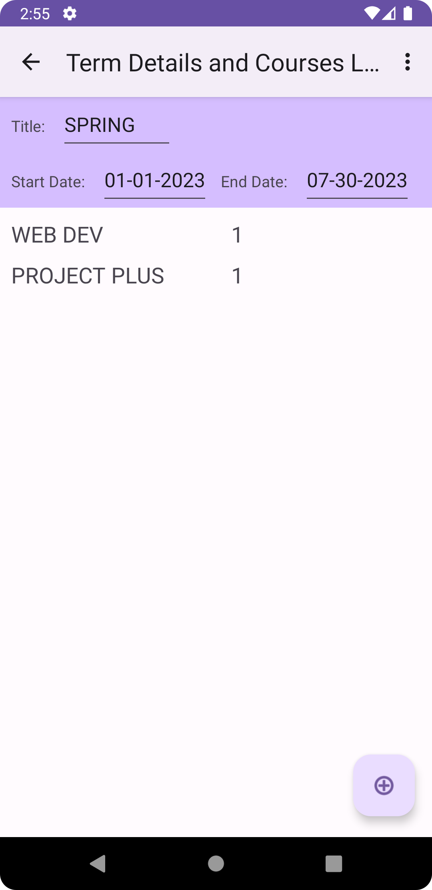
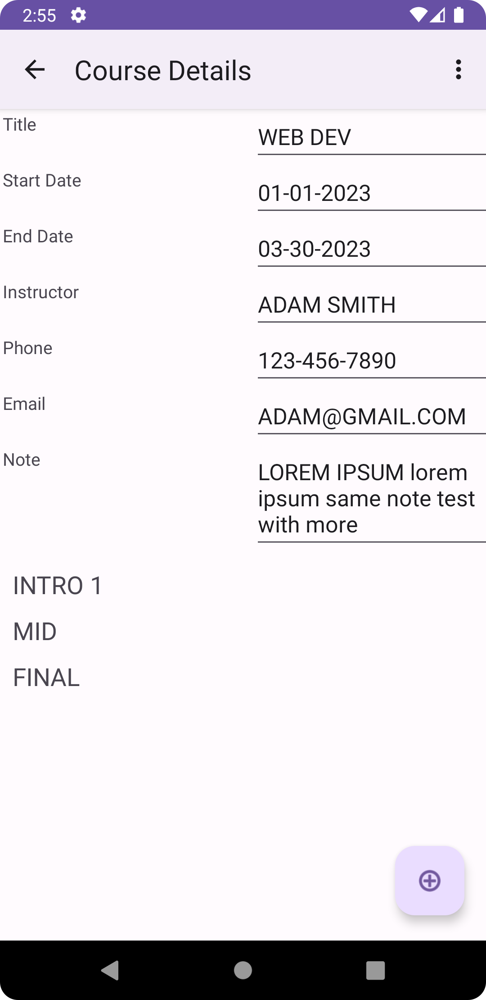
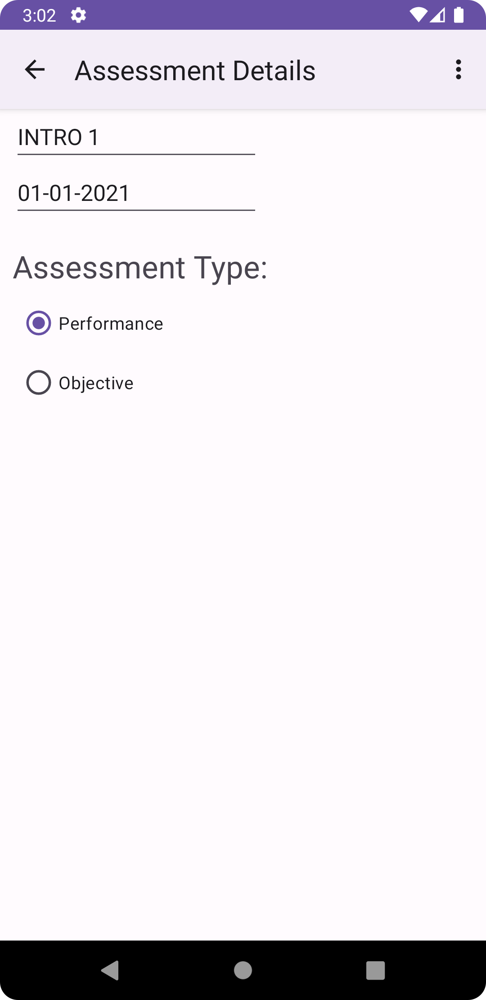
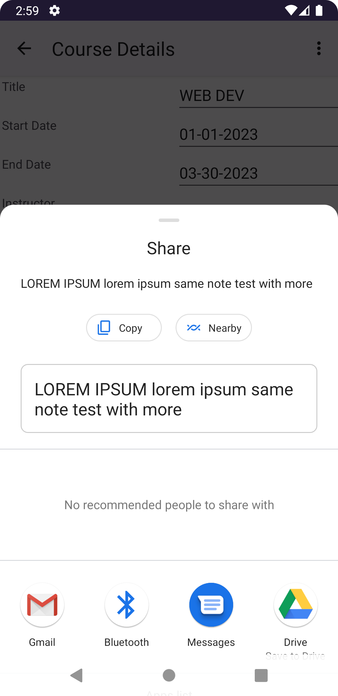

<h1>Term tracking app for Western Governors University</h1>
<h2>Purpose:  
The purpose of a term tracking app for Western Governors University (WGU) would likely focus on enhancing the student experience through:
helping students organize their courses and deadlines, providing easy access to course materials and notifications, 
assisting in managing study schedules and reminders, facilitating communication between students and faculty.
</h2>
<ul>
  <li>Author: Bao Tran</li>
  <li>Application Version 1.1</li>
  <li>IDE: Android Studio</li>
  <li>Framework & Database: Room</li>
</ul>

<h2>MAIN SCREEN:</h2>

<h2>TERM SCREEN:</h2>

<h2>TERM DETAILS SCREEN:</h2>

<h2>COURSE SCREEN:</h2>

<h2>ASSESSMENT DETAILS SCREEN:</h2>

<h2>SHARE SCREEN:</h2>

